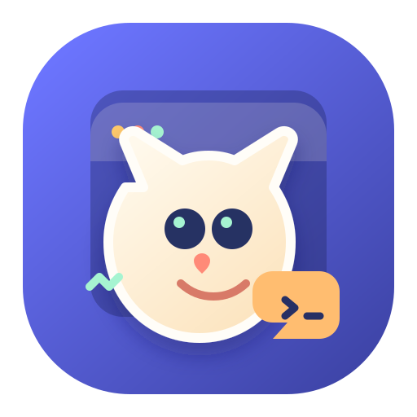

# Desktop Pet Agent

<p align="center">
  
</p>

<p align="center">
  A standalone desktop pet runtime for Codex-compatible pets and real agent hooks.
</p>

Desktop Pet Agent is a standalone Electron desktop pet runtime for agent status feedback.

It can load Codex-compatible pet spritesheets, show a draggable always-on-top desktop pet, display an edge-aware message bubble, and receive real lifecycle hooks from Codex, Claude Code, and CodeBuddy.

The project was built around two ideas:

- Keep the pet runtime independent from any single agent product.
- Normalize agent hook events into a small, stable visual state machine.

## Integrated Agent Hooks

These agent hook integrations are available today:

| Agent | Status | Hook method | Events |
| --- | --- | --- | --- |
| Codex | Supported | `~/.codex/hooks.json` command hooks | 10 events |
| Claude Code | Supported | `~/.claude/settings.json` exec command hooks | 6 events |
| CodeBuddy | Supported | `~/.codebuddy/settings.json` command + HTTP hooks | 9 events |

The project is intentionally built for more agents. PRs for Cursor, Gemini CLI, Qwen Code, OpenCode, Kimi, Copilot, Qoder, and other hook-capable coding agents are welcome.

## Features

- Standalone Electron desktop pet window.
- Reads Codex-compatible pet packages from local `~/.codex/pets` and `~/.codex/pet-runs`.
- Supports Codex fixed 9-row pet action atlas.
- Draggable pet with left/right running animation while moving.
- Idle-only resize handle, matching the original Codex desktop pet behavior.
- Independent bubble window with configurable bubble scale.
- Edge-aware bubble placement near screen boundaries.
- Single active hook source selection: Codex, Claude Code, or CodeBuddy.
- Hook status panel with install/repair buttons.
- Local HTTP API for manual state updates and external integrations.
- Real hook installer for Codex, Claude Code, and CodeBuddy.
- Session aggregation and state priority handling.
- Debounced `working -> thinking` transition to avoid bubble/animation flicker during tool chains.

## Preview

This repo does not ship a default pet asset. It uses pets already installed in:

```text
~/.codex/pets
~/.codex/pet-runs
```

On Windows those paths are usually:

```text
C:\Users\<you>\.codex\pets
C:\Users\<you>\.codex\pet-runs
```

Each pet package should contain a `pet.json` and a Codex-compatible spritesheet such as `spritesheet.webp`.

## Requirements

- Node.js 18+
- npm
- Windows, macOS, or Linux with Electron support

Real hook support depends on the agent being installed and able to load its hook configuration:

| Agent | Config written by this project |
| --- | --- |
| Codex | `~/.codex/hooks.json` and `~/.codex/config.toml` |
| Claude Code | `~/.claude/settings.json` |
| CodeBuddy | `~/.codebuddy/settings.json` |

## Quick Start

Install dependencies:

```bash
npm install
```

Start the pet:

```bash
npm start
```

The local API listens on:

```text
http://127.0.0.1:17861
```

Optional environment variables:

```bash
PET_PORT=17862 npm start
PET_ID=xiao-jin npm start
```

On PowerShell:

```powershell
$env:PET_PORT = "17862"
$env:PET_ID = "xiao-jin"
npm start
```

## Pet Format

Desktop Pet Agent expects the same fixed atlas layout used by Codex pets:

```text
1536 x 1872 image
8 columns x 9 rows
192 x 208 per cell
transparent background
WebP or PNG
```

The 9 rows map to these states:

| State | Meaning |
| --- | --- |
| `idle` | idle / standing |
| `running-right` | dragging or moving right |
| `running-left` | dragging or moving left |
| `waving` | reminder / notification |
| `jumping` | done / happy jump |
| `failed` | sleeping / failed |
| `waiting` | waiting for input or permission |
| `running` | working / coding |
| `review` | thinking / reviewing |

State aliases are also accepted:

| Alias | Normalized state |
| --- | --- |
| `start`, `remind` | `waving` |
| `success`, `done` | `jumping` |
| `sleeping` | `failed` |
| `working` | `running` |
| `thinking` | `review` |

Example `pet.json`:

```json
{
  "id": "my-pet",
  "displayName": "My Pet",
  "description": "A Codex-compatible desktop pet.",
  "spritesheetPath": "spritesheet.webp"
}
```

## Settings

Open settings by double-clicking the pet or from the tray menu.

The settings page supports:

- selecting a pet from `~/.codex/pets` or `~/.codex/pet-runs`;
- manually testing the fixed 9 action states;
- changing pet size;
- changing bubble size independently from pet size;
- checking hook status for Codex, Claude Code, and CodeBuddy;
- installing or repairing hook configuration;
- selecting exactly one active hook source to listen to.

Only one agent is actively listened to at a time. This keeps the UI consistent with the single-pet, single-bubble model. You can still install hooks for multiple agents, but choose the current one in the settings panel.

## Real Hook Setup

Start the app before installing hooks:

```bash
npm start
```

Check hook status:

```bash
npm run hooks:doctor
```

Preview hook changes without writing user config:

```bash
npm run hooks:preview
```

Install all supported hooks:

```bash
npm run hooks:install
```

Install one agent only:

```bash
npm run hooks:install -- --agent codex
npm run hooks:install -- --agent claude-code
npm run hooks:install -- --agent codebuddy
```

Uninstall only hooks managed by this project:

```bash
npm run hooks:uninstall
```

The installer only removes entries containing the project marker:

```text
--desktop-pet-agent-managed
```

Before writing an existing config file, it creates a backup:

```text
*.desktop-pet-agent-backup-<timestamp>
```

### Codex

Codex hooks are written to:

```text
~/.codex/hooks.json
```

The installer also enables hooks in:

```text
~/.codex/config.toml
```

by ensuring:

```toml
[features]
hooks = true
```

Codex command hooks receive stdin JSON and this project forwards the payload to `/events`. The bridge prints `{}` to stdout so Codex hook events that require JSON output do not fail.

### Claude Code

Claude Code hooks are written to:

```text
~/.claude/settings.json
```

Claude Code uses an exec-style hook entry:

```json
{
  "type": "command",
  "command": "node",
  "args": ["src/hook-bridge.js", "--source", "claude-code", "..."],
  "timeout": 3,
  "async": true,
  "asyncRewake": false
}
```

After installing hooks, restart Claude Code or start a new Claude Code session. In Claude Code, run:

```text
/hooks
```

to confirm the external hook configuration is loaded.

### CodeBuddy

CodeBuddy hooks are written to:

```text
~/.codebuddy/settings.json
```

CodeBuddy uses a Claude Code-compatible nested hook format:

```json
{
  "matcher": "",
  "hooks": [
    {
      "type": "command",
      "command": "\"node\" \"src/hook-bridge.js\" --source codebuddy ..."
    }
  ]
}
```

CodeBuddy integration installs 9 events:

```text
SessionStart
SessionEnd
UserPromptSubmit
PreToolUse
PostToolUse
PermissionRequest
Notification
PreCompact
Stop
```

`PermissionRequest` is installed as an HTTP hook:

```text
http://127.0.0.1:17861/permission?source=codebuddy&desktop-pet-agent-managed=1
```

On Windows, CodeBuddy executes hooks through Git Bash. This project quotes Windows paths in generated commands so paths like `D:\node\node.exe` are not broken by shell parsing.

After installing hooks, restart CodeBuddy and run:

```text
/hooks
```

If CodeBuddy asks to approve external hook changes, approve the generated Desktop Pet Agent hooks.

## Hook Event Mapping

The runtime normalizes agent events into the fixed pet states:

| Incoming event | Pet state |
| --- | --- |
| `SessionStart` | `waving`, then `review` |
| `UserPromptSubmit` | `review` |
| `PreToolUse` | `running` or `waiting` for test commands |
| `PostToolUse` | delayed `review` |
| `PermissionRequest` | `waiting` |
| `Notification` | `waving` |
| `Stop` | `jumping`, then idle or aggregate state |
| `StopFailure` | `failed`, then idle or aggregate state |
| `SessionEnd` | clears the session |

OpenPets-style reactions are also accepted:

| Reaction | Pet state |
| --- | --- |
| `thinking` | `review` |
| `working`, `editing`, `running` | `running` |
| `testing`, `waiting` | `waiting` |
| `waving` | `waving` |
| `success`, `done`, `celebrating` | `jumping` |
| `error`, `failed` | `failed` |

## HTTP API

Health check:

```bash
curl http://127.0.0.1:17861/health
```

List pets:

```bash
curl http://127.0.0.1:17861/pets
```

List actions:

```bash
curl http://127.0.0.1:17861/actions
```

Check hook status:

```bash
curl http://127.0.0.1:17861/hooks/status
```

Show a manual state:

```bash
curl -X POST http://127.0.0.1:17861/state \
  -H "Content-Type: application/json" \
  -d '{"state":"working","message":"Agent is working"}'
```

Send a generic agent event:

```bash
curl -X POST http://127.0.0.1:17861/events \
  -H "Content-Type: application/json" \
  -d '{"source":"claude-code","event":"tool_start","sessionId":"demo","message":"Claude is using a tool"}'
```

Send a Claude Code or CodeBuddy-style hook payload:

```bash
curl -X POST http://127.0.0.1:17861/events \
  -H "Content-Type: application/json" \
  -d '{"source":"codebuddy","hook_event_name":"UserPromptSubmit","session_id":"demo"}'
```

Send an OpenPets-style reaction:

```bash
curl -X POST http://127.0.0.1:17861/events \
  -H "Content-Type: application/json" \
  -d '{"source":"openpets","reaction":"thinking","sessionId":"demo"}'
```

Select active hook source:

```bash
curl -X POST http://127.0.0.1:17861/hooks/select \
  -H "Content-Type: application/json" \
  -d '{"agent":"codebuddy"}'
```

Resize bubble independently:

```bash
curl -X POST http://127.0.0.1:17861/bubble/resize \
  -H "Content-Type: application/json" \
  -d '{"bubbleScale":1.2}'
```

Clear sessions:

```bash
curl -X POST http://127.0.0.1:17861/sessions/clear
```

PowerShell 5.1 users should send UTF-8 bytes explicitly when sending Chinese text:

```powershell
$body = '{"state":"thinking","message":"正在思考"}'
Invoke-RestMethod `
  -Method Post `
  -Uri http://127.0.0.1:17861/state `
  -ContentType "application/json; charset=utf-8" `
  -Body ([System.Text.Encoding]::UTF8.GetBytes($body))
```

## Architecture

```text
src/main.js                  Electron main process, windows, settings, HTTP API
src/agent-events.js          Agent event normalization and state mapping
src/session-manager.js       Session aggregation and priority state selection
src/hook-bridge.js           Hook stdin JSON -> local /events bridge
src/hook-installer.js        Codex, Claude Code, CodeBuddy hook installer
src/preload.js               Safe IPC bridge
src/renderer/index.html      Transparent pet window
src/renderer/renderer.js     Spritesheet player, dragging, resizing
src/renderer/styles.css      Pet window styles
src/renderer/bubble.html     Independent message bubble window
src/renderer/bubble.js       Bubble measurement and rendering
src/renderer/bubble.css      Bubble styles
src/renderer/settings.html   Settings window
src/renderer/settings.js     Settings logic
src/renderer/settings.css    Settings styles
```

## Security And Privacy

- The runtime only listens on `127.0.0.1` by default.
- Hook payloads may include prompts, tool names, paths, or command summaries depending on the agent.
- Payloads are forwarded to the local pet runtime only; this project does not send them to a remote service.
- Recent hook events are kept in memory for the settings panel and are not persisted by this app.
- The hook installer modifies only managed hook entries marked by this project.
- Existing agent config files are backed up before writes.

## Troubleshooting

### No pet appears

Check that at least one pet package exists under:

```text
~/.codex/pets
~/.codex/pet-runs
```

Then open:

```text
http://127.0.0.1:17861/pets
```

### Hook status is green but no event appears

Restart the target agent after installing hooks. Claude Code and CodeBuddy may not reload changed hook config in already-running sessions.

For Claude Code and CodeBuddy, run:

```text
/hooks
```

and confirm the external hook configuration is enabled.

### CodeBuddy does not trigger on Windows

CodeBuddy runs hooks through Git Bash on Windows. Reinstall hooks with:

```bash
npm run hooks:install -- --agent codebuddy
```

The generated command should quote Windows paths.

### Chinese text appears as question marks

Use `Content-Type: application/json; charset=utf-8` and send UTF-8 bytes. See the PowerShell example in the HTTP API section.

### Bubble flickers between working and thinking

The runtime debounces `PostToolUse -> review` transitions. If flicker still occurs, check whether another active hook source is sending events. The settings page should show which agent is currently selected.

## Development

Start in dev mode:

```bash
npm run dev
```

Run syntax checks manually:

```bash
node --check src/main.js
node --check src/hook-installer.js
node --check src/hook-bridge.js
```

The project currently does not include a packaged release pipeline. For local hacking, `npm start` is the main workflow.

## Contributing

Desktop Pet Agent is small on purpose: one pet runtime, one local API, and a clear hook adapter layer. The most valuable PRs are integrations and hard compatibility fixes.

Good PR targets:

- add a new agent hook installer;
- improve hook detection for an existing agent;
- add platform-specific fixes for Windows, macOS, or Linux;
- add packaged release support;
- add tests for hook installer edge cases;
- improve Codex-compatible pet loading and validation;
- add documentation for real-world agent setup flows.

For a new agent integration, please include:

- config path and schema documentation;
- install, doctor, preview, and uninstall behavior;
- event mapping into the 9 fixed pet states;
- stdout or HTTP response requirements for blocking hooks;
- a manual verification command or test script;
- notes about restart, approval, or security prompts in the target agent.

PRs that make more agents work reliably are especially welcome. The goal is to make this a shared desktop companion layer for the agent ecosystem, not a one-off integration.

## License

MIT. See [LICENSE](LICENSE).
