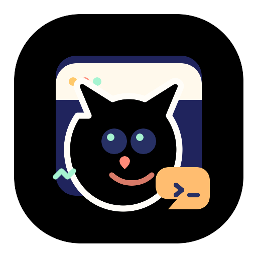

# Our Pets

<p align="center">
  
</p>

<p align="center">
  私人定制桌面宠物应用，内置多角色，托盘切换，支持 V2 精灵图。
</p>

<p align="center">
  <a href="README.md">English README</a>
</p>

> 基于 [yangbuyiya/desktop-pet](https://github.com/yangbuyiya/desktop-pet) fork 改造。原项目 MIT 许可证见 [LICENSE](./LICENSE)。

## 功能

- 独立 Electron 桌面宠物窗口，保留托盘图标，但宠物主窗口不占用系统任务栏。
- 内置 `src/assets/pets` 下的宠物，首次启动就有可用宠物。
- 只从当前选中的宠物目录加载 Codex 兼容宠物，默认目录是 `~/.codex/pets`。
- 保留兼容宠物获取渠道链接：Petdex、Codex Pets、SpriteYard、Codex Pet Shop。
- 支持 `.codex` 宠物目录和自定义宠物文件夹。
- 支持 Codex 固定 8 列 x 9 行宠物动作图集。
- 拖拽宠物时自动播放向左/向右移动动画。
- 仅空闲状态显示缩放手柄，气泡大小可独立调整。
- 内置 Codex、Claude Code、CodeBuddy hook 安装器。
- 本地 HTTP API 支持状态更新、宠物选择、hook 状态和外部集成。
- 支持会话聚合，并对 `working -> thinking` 做防闪烁延迟处理。

## 快速开始

```bash
npm install
npm start
```

运行测试：

```bash
npm test
```

本地打包验证：

```bash
npm run build:unpack
```

## 发布与自动更新

项目使用 GitHub Actions 和 `electron-builder` 发布版本。推送 `v*` tag 后会构建 Windows x64 与 macOS universal 安装包，并上传到 [GitHub Releases](https://github.com/Robben-Ge/desktop-pet/releases)。自动更新同样从该 Release 读取 `latest.yml` 和 `latest-mac.yml`。

发布新版本：

```bash
./scripts/release-publish.sh 0.1.1
```

也可以在 GitHub Actions 的 `release` workflow 手动输入 tag 触发构建。

本地 API 默认监听：

```text
http://127.0.0.1:17861
```

可选环境变量：

```bash
PET_PORT=17862 npm start
PET_ID=boba npm start
```

## 宠物存储

默认从这里读取宠物：

```text
~/.codex/pets
```

Windows 通常是：

```text
C:\Users\<you>\.codex\pets
```

设置窗口可以切换当前宠物存储位置：

| 存储位置 | 用途 |
| --- | --- |
| `.codex` 宠物 | 默认 Codex 兼容宠物目录。 |
| 自定义文件夹 | 用户手动选择的文件夹。 |

运行时只加载当前选中的宠物目录。`~/.codex/pet-runs` 下的生成记录不会自动加载。

`src/assets/pets` 下的内置宠物会始终显示，并和当前用户目录里的宠物分开标记。

## 宠物获取渠道

请从下列站点下载宠物包，解压后放入当前宠物目录，或在设置页切换到自定义宠物文件夹。

| 站点 | 说明 |
| --- | --- |
| [Petdex](https://petdex.crafter.run/zh) | 浏览和安装/下载 Codex 兼容宠物。 |
| [Codex Pets](https://codex-pets.net/) | 浏览社区分享的 Codex 宠物。 |
| [SpriteYard](https://spriteyard.com/) | 浏览 animated Codex companion packages。 |
| [Codex Pet Shop](https://www.codexpetshop.com/) | 下载 zip 包并复制到 `~/.codex/pets`。 |

请只使用你有权使用的宠物。素材仍归原作者或权利方所有。

## 宠物格式

每个宠物是一个目录，至少包含 `pet.json` 和精灵图：

```text
my-pet/
  pet.json
  spritesheet.webp
```

期望图集格式：

```text
1536 x 1872 图片
8 列 x 9 行
每格 192 x 208
透明背景
WebP 或 PNG
```

9 行动作映射如下：

| 行 | 状态 | 含义 |
| --- | --- | --- |
| 0 | `idle` | 空闲 / 站立 |
| 1 | `running-right` | 拖拽时向右移动 |
| 2 | `running-left` | 拖拽时向左移动 |
| 3 | `waving` | 提醒 / 通知 |
| 4 | `jumping` | 完成 / 开心跳跃 |
| 5 | `failed` | 睡觉 / 失败 |
| 6 | `waiting` | 等待输入或权限 |
| 7 | `running` | 工作 / 编码中 |
| 8 | `review` | 思考 / 审查 |

`pet.json` 示例：

```json
{
  "id": "my-pet",
  "displayName": "My Pet",
  "description": "A Codex-compatible desktop pet.",
  "spritesheetPath": "spritesheet.webp"
}
```

## Agent Hooks

当前支持：

| Agent | 状态 | 配置路径 | 事件数量 |
| --- | --- | --- | --- |
| Codex | 已支持 | `~/.codex/hooks.json`, `~/.codex/config.toml` | 10 |
| Claude Code | 已支持 | `~/.claude/settings.json` | 6 |
| CodeBuddy | 已支持 | `~/.codebuddy/settings.json` | 9 |

安装 hook 前先启动应用：

```bash
npm start
```

检查、预览、安装：

```bash
npm run hooks:doctor
npm run hooks:preview
npm run hooks:install
```

只安装某一个 Agent：

```bash
npm run hooks:install -- --agent codex
npm run hooks:install -- --agent claude-code
npm run hooks:install -- --agent codebuddy
```

卸载本项目管理的 hook：

```bash
npm run hooks:uninstall
```

## HTTP API

健康检查：

```bash
curl http://127.0.0.1:17861/health
```

列出宠物：

```bash
curl http://127.0.0.1:17861/pets
```

切换宠物存储：

```bash
curl -X POST http://127.0.0.1:17861/pets/storage \
  -H "Content-Type: application/json" \
  -d '{"storage":"codex"}'
```

手动显示状态：

```bash
curl -X POST http://127.0.0.1:17861/state \
  -H "Content-Type: application/json" \
  -d '{"state":"working","message":"Agent is working"}'
```

选择当前监听的 hook 来源：

```bash
curl -X POST http://127.0.0.1:17861/hooks/select \
  -H "Content-Type: application/json" \
  -d '{"agent":"codebuddy"}'
```

## 项目结构

```text
src/main.js                  Electron 主进程、窗口、设置、本地 HTTP API
src/pet-library.js           宠物发现和存储切换
src/agent-events.js          Agent 事件归一化和状态映射
src/session-manager.js       会话聚合和优先级状态选择
src/hook-bridge.js           hook stdin JSON -> 本地 /events 桥接
src/hook-installer.js        Codex、Claude Code、CodeBuddy hook 安装器
src/preload.js               安全 IPC 桥
src/renderer/index.html      透明宠物窗口
src/renderer/renderer.js     精灵图播放、拖拽、缩放
src/renderer/bubble.html     独立消息气泡窗口
src/renderer/settings.html   设置窗口
test/pet-library.test.js     宠物加载和存储测试
```

## 安全与隐私

- 运行时默认只监听 `127.0.0.1`。
- Agent hook payload 可能包含 prompt、工具名、路径或命令摘要，取决于具体 Agent。
- payload 只转发给本地运行时，本项目不会上传 hook 数据。
- 最近 hook 事件只保存在内存中，用于设置页展示，不持久化。
- hook 安装器只修改带有本项目标记的托管 hook。
- 写入已有 Agent 配置前会先备份。

## 常见问题

### 没有显示宠物

确认当前选中的宠物目录里至少有一个宠物包。默认目录是：

```text
~/.codex/pets
```

并确认宠物目录包含 `pet.json` 和有效的 `spritesheet.webp` 或 `spritesheet.png`。

### Hook 状态是绿色但没有事件

安装 hook 后重启目标 Agent。Claude Code 和 CodeBuddy 可能不会在已运行会话中重新加载 hook 配置。

Claude Code 和 CodeBuddy 可以运行：

```text
/hooks
```

确认外部 hook 配置已启用。

### 托盘图标不显示

应用会把常驻入口放在系统托盘里，而不是系统任务栏里。如果 Windows 没有立刻刷新托盘图标，请完全退出应用后重新启动。

## 开发

```bash
npm run dev
npm test
```

## 许可证

MIT。见 [LICENSE](LICENSE)。
